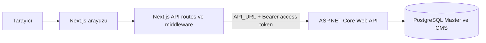

# SaaS Frontend

Next.js tabanlı bu uygulama, çok kiracılı bütçe ve masraf yönetimi SaaS ürününün web arayüzüdür. Şirket kullanıcıları organizasyon birimlerini ve dönemsel bütçeleri yönetebilir; masraflarını oluşturabilir, yetkileri kapsamında onay ve ret süreçlerini yürütebilir. Arayüz ayrıca kullanıcı profili ve abonelik yönetimi ekranları sunar.

Backend ayrı bir depoda bulunan ASP.NET Core Web API'dir. API, PostgreSQL'deki Master ve CMS veritabanları, tenant izolasyonu ve abonelik/modül yetkilendirmesinin sahibidir.

> Bu depo yalnızca frontend'i içerir. Uygulamanın tam mimarisi, veri modeli, backend kurulumu ve veritabanı betikleri için [backend deposundaki README'ye](https://github.com/Lightarasohn/SaaS) bakın.

## Özellikler

- Ürün tanıtım sayfası ve backend'den yüklenen abonelik planları/fiyatlandırma.
- Kayıt, giriş, e-posta doğrulama, parola/e-posta kurtarma ve hesap işlemleri.
- Bütçe ve masraf dashboard'u; birim, kategori, bekleyen onay ve kullanıcının kendi masrafları görünümleri.
- Organizasyon birimleri, birim üyeleri ve rollerin yönetimi.
- Masrafları tekli/toplu oluşturma, uygunluk kontrolü, onaylama ve reddetme.
- Abonelik planı, yenileme ve otomatik yenileme ekranları.
- Next.js API route'ları üzerinden backend proxy/BFF katmanı; erişim ve refresh token'ları `HttpOnly` cookie'lerde tutan oturum akışı.

## Teknolojiler

- Next.js 16 ve React 19
- Tailwind CSS 4
- React Hook Form ve Zod ile form/doğrulama
- ASP.NET Core Web API backend

## Mimari



Next.js route handler'ları backend endpoint'lerine istek iletir; sunucu tarafındaki `fetchServer` access token'ı cookie'den okuyup Bearer header'ına ekler. Middleware korumalı dashboard sayfalarında access token cookie'sinin varlığını kontrol eder; cookie yokken refresh token varsa backend'den yeni token çifti ister. Token imzası/süresi ve tenant/modül erişimi API tarafından doğrulanır. Tenant ve modül erişim kararları frontend'e değil backend'e aittir.

## Gereksinimler

- Node.js 20.9 veya üzeri
- npm
- Çalışan SaaS backend ve PostgreSQL veritabanları

Backend'i ve veritabanlarını hazırlama talimatları için [backend kurulum rehberini](https://github.com/Lightarasohn/SaaS) izleyin.

## Yerelde Çalıştırma

### 1. Depoları klonlayın

```bash
git clone https://github.com/Lightarasohn/saas-front-next.git
git clone https://github.com/Lightarasohn/SaaS.git
```

### 2. Backend adresini tanımlayın

Frontend klasöründe `.template.env.local` dosyasını `.env.local` olarak kopyalayın ve backend adresini ayarlayın:

```dotenv
API_URL=http://localhost:5012
```

`API_URL`, Next.js API route'ları ve middleware tarafından sunucu tarafında kullanılır. Uygulama için `NEXT_PUBLIC_API_URL` gerekli değildir. Yerel backend'in varsayılan adresi `http://localhost:5012`'dir.

### 3. Backend'i başlatın

Backend'i ayrı bir terminalde, backend deposunun README'sinde anlatıldığı şekilde çalıştırın. Yerel frontend adresi backend'in geliştirme CORS izin listesinde `http://localhost:3000` olarak tanımlıdır.

### 4. Frontend'i başlatın

```bash
cd saas-front-next
npm ci
npm run dev
```

Uygulamayı [http://localhost:3000](http://localhost:3000) adresinde açın. Geliştirme sunucusu değişiklikleri otomatik yükler.

## Komutlar

| Komut | Açıklama |
| --- | --- |
| `npm run dev` | Geliştirme sunucusunu başlatır. |
| `npm run build` | Production build'i oluşturur. |
| `npm start` | Oluşturulmuş production build'ini çalıştırır. |
| `npm run lint` | ESLint kontrollerini çalıştırır. |

## İlgili Depolar

- [Backend, mimari/veri modeli ve kurulum rehberi](https://github.com/Lightarasohn/SaaS)
- [Frontend kaynak kodu](https://github.com/Lightarasohn/saas-front-next)

## Kapsam Notları

- Çalışan iş modülü bütçe ve masraf yönetimidir (CMS). HR ekranları/iş akışları bu frontend'de uygulanmış değildir.
- Ödeme sağlayıcısı entegrasyonu backend'de demo adapter'ı düzeyindedir; abonelik ekranları gerçek tahsilat yapıldığı anlamına gelmez.
- Bu frontend tek başına çalışmaz; API ve gerekli PostgreSQL veritabanları da çalışır durumda olmalıdır.
